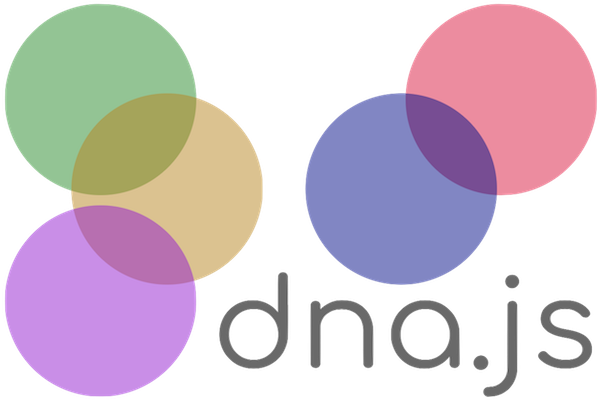

# DNA.js

## Aqui contem exemplos sobre o DNAJS



## Sobre o DNAJS

O DNAJS é uma lib super leve que visa o desenvolvimento de aplicações webs de forma rápida e organizada. Abaixo temos um exemplo simples de seu uso, o código pode ser baixado na pasta: chamada exemple one.

``` html
<!DOCTYPE html>
<html>
    <head>
        <title></title>
        <meta charset="UTF-8">
        <meta name="viewport" content="width=device-width, initial-scale=1">
        <!--CSS-->
        <link rel="stylesheet" href="css/style.css">
    </head>
    <body>
        <div class="container">
            <div class=card id=cards>
                <h2>~~title~~</h2>
                <p>~~post~~</p>
                Autor: <cite>~~author~~</cite>
             </div>
        </div>
        <!--js-->
        <script src="js/jquery.min.js"></script>
        <script src="js/dna.js"></script>
        <script src="js/templateDNA.js"></script>
    </body>
</html>
```
```
CSS

/*
Global properties
*/
*{
    box-sizing: border-box;
    font: inherit;
    font-size: 100%;
    line-height: 1.6;
    margin: 0;
    padding: 0;
}
:root{
    --roboto:  -apple-system, BlinkMacSystemFont, 'Segoe UI', Roboto, Oxygen, Ubuntu, Cantarell, 'Open Sans', 'Helvetica Neue', sans-serif; 
}
h1, h2, h3, h4, p{
    font-family: var(--roboto);
}
/*
Local Properties
*/ 

/*
container
*/ 
.container{
    display: flex; 
    flex-direction: column;
}
/*
card
*/ 
.card{
    border:  1px solid #eee;
    margin: 5%; 
    padding: 1rem; 
}
.card h2{
    font-size: 2rem;
}


/*last desktop*/

@media(min-width: 48rem){
    .container{flex-direction: row; }
    .card{
        width: 30%;
    }
}

```

```js
const cards =[
    {title: 'Artigo-um', post: 'O Lorem Ipsum é um texto modelo da indústria tipográfica e de impressão. O Lorem Ipsum tem vindo a ser o texto padrão usado por estas indústrias desde o ano de 1500, quando uma misturou os caracteres de um texto para criar um espécime de livro. Este texto não só sobreviveu 5 séculos, mas também o salto para a tipografia electrónica, mantendo-se essencialmente inalterada. Foi popularizada nos anos 60 com a disponibilização das folhas de Letraset, que continham passagens com Lorem Ipsum, e mais recentemente com os programas de publicação como o Aldus PageMaker que incluem versões do Lorem Ipsum.',  author: 'Andre Laurentino'},
    {title: 'Artigo-dois', author: 'Andre Laurentino'},
    {title: 'Artigo-tres', author: 'Andre Laurentino '},
]; 
dna.clone('cards', cards);
//Create DOM elemento

```
